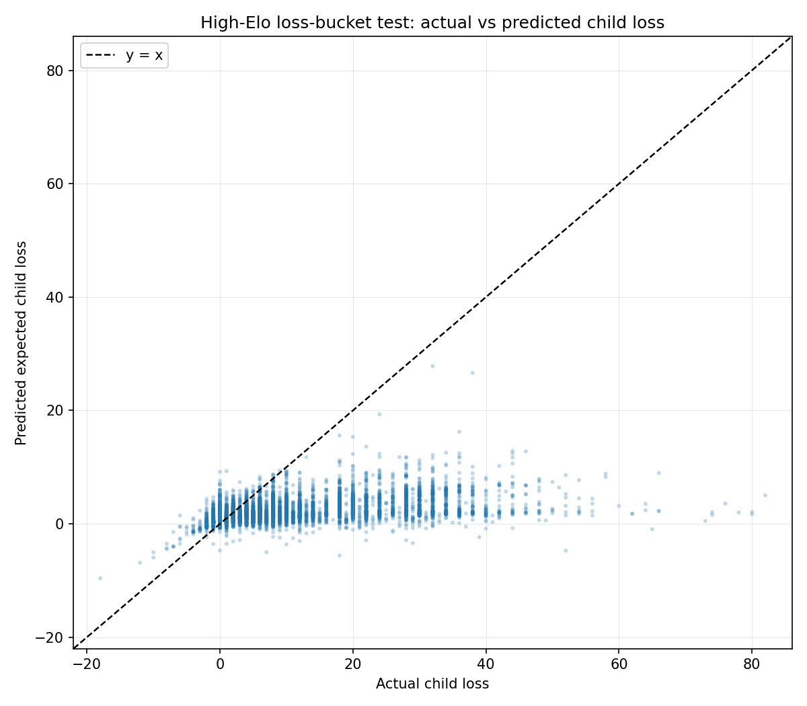

# High-Elo Raw Ridge Test

- Created: 2026-06-16T01:15:42
- Train rows: 37,943 recent5 rows with target_elo >= 1750
- Test rows: 9,000 loss-bucket rows with target_elo >= 1750
- Feature set: clean_compact (15 features)

## Overall Metrics
| split | count | mae | mse | rmse | r2 | bias_pred_minus_true | true_mean | pred_mean |
| --- | --- | --- | --- | --- | --- | --- | --- | --- |
| train_recent5_elo_ge1750 | 37943 | 2.220080 | 11.142907 | 3.338099 | 0.131512 | -0.000000 | 1.424532 | 1.424532 |
| test_loss_bucket_elo_ge1750 | 9000 | 8.038185 | 161.251652 | 12.698490 | -0.278010 | -7.147424 | 9.220667 | 2.073243 |

## Metrics By Actual-Loss Bucket
| loss_bucket | count | mae | mse | rmse | r2 | bias_pred_minus_true | true_mean | pred_mean |
| --- | --- | --- | --- | --- | --- | --- | --- | --- |
| 0 | 1000 | 1.571202 | 3.619516 | 1.902503 | -35.288057 | 1.511890 | 0.016000 | 1.527890 |
| 0-2 | 1000 | 0.700865 | 0.909338 | 0.953592 | -30.409555 | 0.182906 | 1.007000 | 1.189906 |
| 10-18 | 1000 | 9.348290 | 94.338804 | 9.712816 | -23.625376 | -9.348290 | 11.821000 | 2.472710 |
| 18-28 | 1000 | 17.433317 | 315.206703 | 17.754062 | -45.713130 | -17.433317 | 20.733000 | 3.299683 |
| 2-5 | 1000 | 1.416723 | 3.032765 | 1.741484 | -2.817853 | -0.952806 | 2.806000 | 1.853194 |
| 28+ | 1000 | 30.153252 | 974.070061 | 31.210095 | -15.807178 | -30.153252 | 33.880000 | 3.726748 |
| 5-8 | 1000 | 3.989048 | 18.039207 | 4.247259 | -42.249118 | -3.957236 | 5.870000 | 1.912764 |
| 8-10 | 1000 | 5.937499 | 37.940145 | 6.159557 | -267.888340 | -5.932850 | 8.170000 | 2.237150 |
| negative | 1000 | 1.793466 | 4.108327 | 2.026901 | -1.812938 | 1.756142 | -1.317000 | 0.439142 |

## Plot

